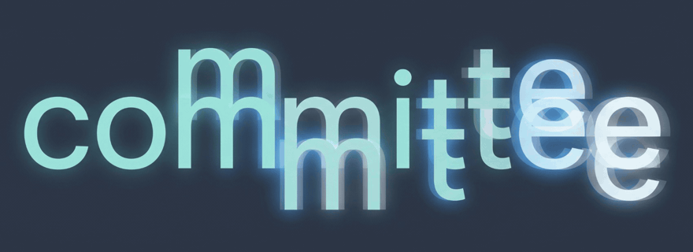

# committee

<p align="center">
  
</p>

*Where the whole team — human or coding agent — agrees on how to commit,
branch, version and review.*

A small kit that makes a GitHub repository follow
[Conventional Commits](https://www.conventionalcommits.org),
[Conventional Branch](https://conventionalbranch.org),
[Semantic Versioning](https://semver.org) and
[Conventional Comments](https://conventionalcomments.org) — and keeps
following them when most of the commits are being written by Claude Code or
Codex.

Two layers, because neither works alone. A **Skill** and an **`AGENTS.md`**
explain the conventions and *why* a given type fits a change — the judgment
a regex cannot make. **Hooks and CI** reject a malformed branch or commit
regardless of what any agent or human decided.

`.claude/git-conventions.yaml` holds the allowed types, scopes, prefixes and
labels. The Skill, `AGENTS.md`, `commitlint.config.js` and
`.githooks/pre-push` all read it; none of them restate it. Add a type there
and it is allowed everywhere at once, locally and in CI.

→ [Why it is shaped this way](docs/design.md)

## Install

### The whole kit

```bash
git clone https://github.com/otomamaYuY/committee.git /tmp/committee
/tmp/committee/install.sh /path/to/your/repo
cd /path/to/your/repo && npm install    # or pnpm install / yarn install
```

The target must already exist and be a git repository. `install.sh` points
`core.hooksPath` at the tracked `.githooks/` directory, so the hooks are
live on your machine right away.

**For everyone else, `npm install` is what activates them.** `core.hooksPath`
lives in `.git/config`, which is never committed, so a teammate's fresh
clone has the hook *files* and nothing running them until the `prepare`
script in `package.json` wires it up on their first install. If your repo
already had a `package.json`, the installer tells you to add that script
yourself — skip it and the hooks run for exactly one person on the team,
silently.

**Existing files are never overwritten.** Anything already there is left
alone and listed under `Skipped`, with a warning where it matters. Pass
`--force` to overwrite instead. A repo that already routes hooks elsewhere
(husky, say) is detected rather than hijacked.

### Just the Skill

```bash
npx skills add otomamaYuY/committee --skill git-conventions
```

The knowledge layer only — nothing stops an agent that ignores it. Via the
[skills](https://github.com/vercel-labs/skills) CLI; checked against that
CLI's documentation, not by running it here.

## What you get

```
.claude/
  git-conventions.yaml              # the one file above
  skills/git-conventions/SKILL.md   # knowledge layer, Claude Code
AGENTS.md                           # knowledge layer, Codex and others
commitlint.config.js
.githooks/
  commit-msg                        # Conventional Commits, every commit
  pre-push                          # Conventional Branch, every push
.github/workflows/conventions.yml   # all three again, on every PR
package.json                        # three dev dependencies
```

On a pull request CI checks the commit messages, the branch name, and the
**pull request title** — which matters more than it sounds: GitHub turns that
title into a commit subject on your default branch, as the squash commit's
subject on a squash workflow or as the merge commit's where merge commits are
configured to use it. It is also the one string nothing else here checks.

The branch check is the *same* `pre-push` script developers run locally,
driven through git's own protocol rather than re-implemented, so the two
cannot drift apart.

## Requirements

**Node 22.12 or newer**. On Linux, CI exercises npm, pnpm, Yarn Classic and
Yarn PnP. On Windows it exercises npm, through Git Bash.

→ [What is verified, and what is not](docs/compatibility.md)

## Contributing

[CONTRIBUTING.md](CONTRIBUTING.md) covers the test suites and how to run
what CI runs. `main` is protected: changes go through a pull request, and
the `conventions` and `test` checks must pass. Report security issues
privately — see [SECURITY.md](SECURITY.md).

## License

MIT — see [LICENSE](LICENSE). The four specifications this kit implements
are each licensed separately by their own maintainers (see the linked
sites); this repo only links to and implements them, it doesn't redistribute
their text.
