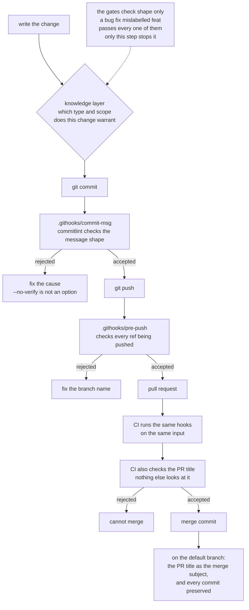
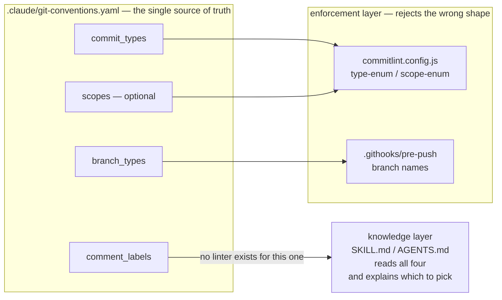

# Why the kit is shaped this way

The reasoning behind the two layers, the single config file, and the things
this kit deliberately does not do. [README](../README.md) is the short
version.

## Why two layers

You can tell an agent the conventions. A `CLAUDE.md`, an `AGENTS.md`, a
Skill — all of it is *context*: the agent usually complies, and "usually" is
not a guarantee you can put in a changelog. You can also just add a linter,
but a linter cannot tell that a bug fix was labelled `feat:`.

So the kit ships both, and neither is decoration:

| Layer | What it does | How |
|---|---|---|
| **Knowledge** | Explains the conventions and *why* a given type fits a change — the judgment a regex cannot make | A Claude Code [Skill](https://code.claude.com/docs/en/skills), and an `AGENTS.md` for Codex and other agents |
| **Enforcement** | Rejects a malformed branch or commit regardless of what any agent or human decided | `commitlint`, two git hooks, one GitHub Actions workflow |

The enforcement layer only checks **shape**. `feat: fix the null check`
passes every rule in this repo, and the type is what a reader, a changelog
and any release tooling use to understand what changed — so a mislabelled
commit misstates the change to everyone downstream. That judgment is what
the knowledge layer is for.

And [Conventional Comments](https://conventionalcomments.org) has no linter
anywhere. For review comments, the knowledge layer is the only thing there
is.

Which is to say: a change passes several gates, and every one of them is
checking the same thing — shape.



## One file decides everything

`.claude/git-conventions.yaml` holds the allowed commit types, scopes,
branch prefixes and review labels. Nothing else restates them:

```
.claude/git-conventions.yaml
        │
        ├──► .claude/skills/git-conventions/  the Skill quotes it to Claude Code
        ├──► AGENTS.md                        points Codex at it
        ├──► commitlint.config.js             loads commit_types into type-enum,
        │                                     and scopes into scope-enum if present
        └──► .githooks/pre-push               parses branch_types out of it
```

Add a type there and it is allowed everywhere at once — locally and in CI,
with no second list to remember and no way for the hook and the pipeline to
disagree.

Drawn out, with the keys separated from their readers — the point being that
`comment_labels` is the only one with no path into the enforcement layer at
all:



### Why `scopes:` is the one optional list

The other three lists come from the specs, so the kit can ship them. Scopes
do not: they name the seams of one particular repo, and a guessed default
would reject correct commits in every repo that installed it — which is how
a contributor ends up reaching for `--no-verify`, the one habit this kit
exists to prevent. So the template ships the block commented out, and
`scope-enum` is added only once a repo has written its own list.

It is worth writing one. A type says what a change did; a scope says where.
Together they make the history answerable without reading the diffs — by a
person catching up, and by any tool, including an agent orienting itself in
a repo it has not seen. A repo with no scopes list still works exactly as
before; it just cannot be asked that second question.

## What this kit does not do

- **It does not automate releases.** SemVer is explained to the agent, not
  automated by a pipeline. Adding `semantic-release` yourself is a handful
  of lines; having it in every adopting repo meant ~480 transitive
  dependencies against this kit's 95, and a workflow holding a
  `contents: write` token — a poor default for a conventions kit.
- **It does not enforce Conventional Comments.** No linter for it exists.
  The knowledge layer is the whole story there.
- **It does not manage your Node environment.** If you use pixi, nix or
  anything else, you have already solved that; the kit does not model it.

## Why merge commits, not squash

A squash merge discards a pull request's commits at merge time, and there is
no getting them back. That is a reasonable trade when the intermediate
commits are scaffolding. It is a poor one here: most commits in this repo are
written by an agent, and the per-step commits are the record of *how* a change
was reached. The diff does not carry that, and neither does one squashed
subject.

A merge commit costs nothing to get the squashed view back — `git log
--first-parent` is one line per pull request — while keeping the detail
underneath. It is strictly more information, and the summary is still there
on demand.

Most repos cannot make this trade, because their branch commits are `wip` and
`fix typo`. Here they cannot be: CI runs commitlint over every commit in a
pull request, not just the title, and `wip` is not a type this repo allows. The
enforcement layer is what makes preserving the commits worth doing.

**Rebase merge was the other candidate.** It also preserves the commits, and
keeps `main` linear as well. It was rejected for what it throws away instead:
the merge commit is the node that says *these ten commits were one reviewed
unit*, and without it `--first-parent` has nothing to follow. Grouping is the
thing being bought.

**The costs, plainly.** `main` is no longer linear. `git log` without
`--first-parent` is noisier. `git bisect` can land on a commit that never ran
through CI, since only the tip of a branch is guaranteed green — `git bisect
--first-parent` walks the merges instead when that bites.

**Settings had to change first, in two places.** GitHub's default merge commit
subject is `Merge pull request #17 from owner/branch`, which is not a
Conventional Commit — this repo would have started violating its own rule at
the moment it switched. The repository is set to take the pull request title
as the merge subject instead — and GitHub appends ` (#19)` to it the same way
it does for a squash, so the back-reference to the pull request survives.
That is also the second reason the workflow checks that title: it is not a
label on a pull request, it is a subject on `main`.

The second place is the ruleset on `main`, which carries its own
`allowed_merge_methods`. **The effective merge method is the intersection of
the two**, so changing one alone does not switch strategies — it removes
every option and nothing can be merged at all. That is not hypothetical:
this repo's own switch was made by changing the repository setting first, and
the next pull request could not be merged by any method until the ruleset
caught up. If you are copying this decision, change both, and change the
ruleset first.

**There is no test for any of this, and there cannot usefully be one.** The
subject is a GitHub setting; nothing in this repo can observe it without a
token and a network call. The one cheap guard — a job on `push: main` running
commitlint over the new subject — would fire after the bad commit is already
on `main`, and only repeats what the pull request title check already
established before the merge. The real guard for a setting is the ruleset,
which is also where the allowed merge methods are pinned, and which no file
in this repository can enforce on its own behalf.

**None of this is shipped.** The kit takes no position on an adopting repo's
merge strategy, and the workflow it installs says so: the pull request title
is checked because it becomes a default-branch subject under squash *and*
under merge commits, and because nothing else looks at it.

## This repo dogfoods itself

Scaffolded with its own `install.sh`. The root `.claude/`, `.githooks/`,
`AGENTS.md` and `commitlint.config.js` are the live example — and
`tests/drift_test.js` fails if any of them drifts from `templates/`, so the
example cannot quietly stop matching what you would install.
